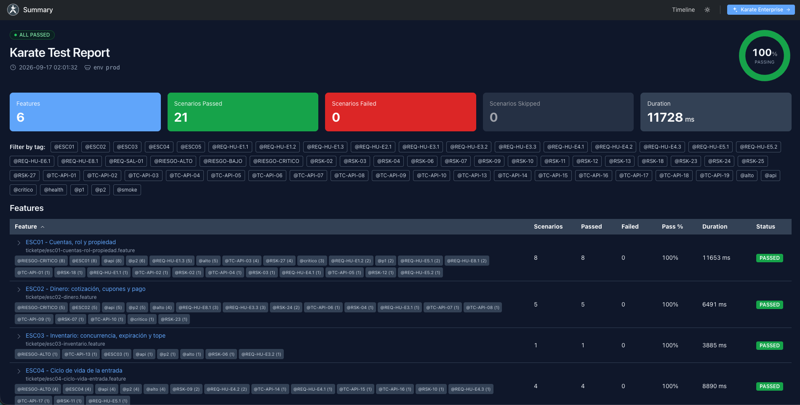
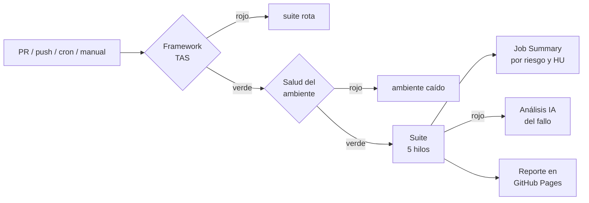
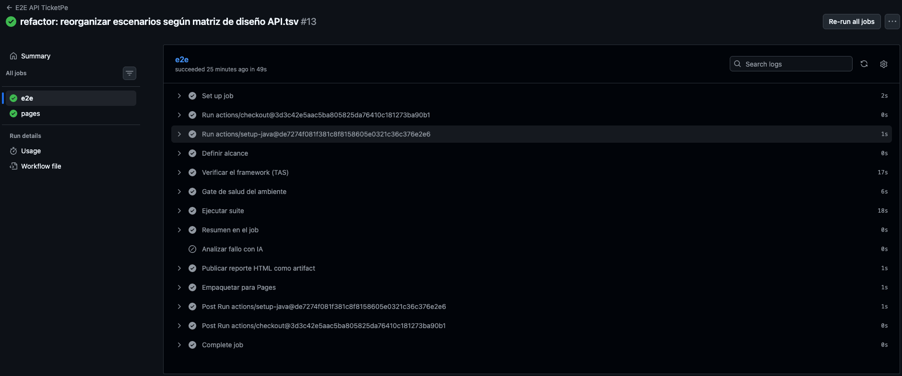
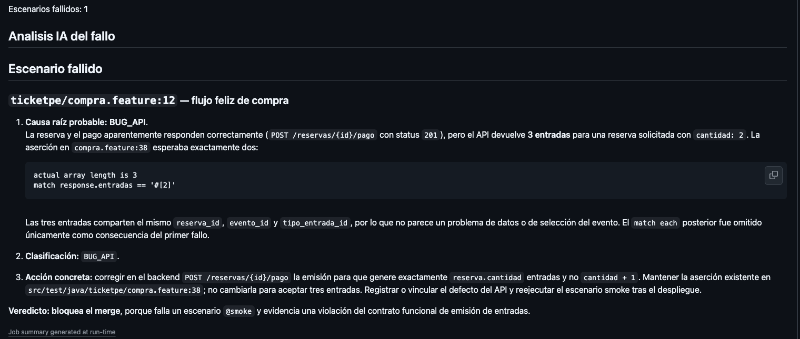
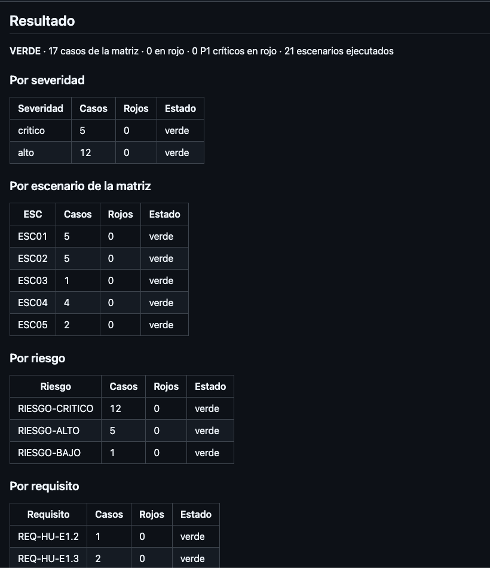

# ticketpe-qa-back-core

[](https://fmarinoa.github.io/ticketpe-qa-back-core/)

**Suite E2E de API que protege los riesgos de negocio de TicketPe Núcleo**: escalamiento de rol,
IDOR, doble cobro, sobreventa y fuga de datos personales. Karate 2.1.2 · Maven · JUnit 6 · GitHub Actions.

Equipo **TesTitans** · Testathon 2026 · entregable R5 (automatización).

| | |
|---|---|
| 📊 **Reporte en vivo** (última corrida) | https://fmarinoa.github.io/ticketpe-qa-back-core/ |
| 🧭 **Casos de origen** (matriz R3) | [`R3-diseno-pruebas/tsv/API.tsv`](https://github.com/testingperuoficial/testathon2026/blob/testitans/R3-diseno-pruebas/tsv/API.tsv) |
| 🐞 **Defectos encontrados** (R4) | [`R4-ejecucion-reporte-defectos/defectos.md`](https://github.com/testingperuoficial/testathon2026/blob/testitans/R4-ejecucion-reporte-defectos/defectos.md) |
| ⚙️ **Pipeline** | [`.github/workflows/e2e.yml`](.github/workflows/e2e.yml): PR, push, cron diario y manual |

## Resultado

Última corrida en CI (run #13, `prod`, 2026-09-16):

| Casos de la matriz | Escenarios | Resultado | Duración |
|---|---|---|---|
| 17 (5 críticos, 12 altos) | 21 (con Examples) | **100 % verde** | ~12 s en 5 hilos |

La suite **no ajusta aserciones para pasar**: el oráculo es la matriz R3. Una
desviación del API se reporta en R4 con la evidencia que deja la corrida
(`feature:línea`, request/response y `X-Request-Id`).



## Qué riesgos cubre

No se automatiza el API entero: se automatiza **donde una falla cuesta plata o confianza**
(impacto × probabilidad de regresión, [`STRATEGY.md`](STRATEGY.md)).

| Riesgo de negocio | Qué se prueba | Casos | Riesgo |
|---|---|---|---|
| **Cuentas, rol y propiedad** | el rol lo decide el token y no el body · un token alterado se rechaza · un asistente no ve la entrada de otro (IDOR) · un organizador no opera eventos ajenos | CP01-CP05 | Crítico |
| **Dinero** | el descuento se aplica antes del IGV · cupones inválidos, agotados o vencidos · reintento tras pago rechazado · **dos pagos simultáneos emiten las entradas una sola vez** | CP06-CP10 | Crítico |
| **Datos personales y texto libre** | el reporte de ventas no expone compradores · texto malicioso no rompe el backend | CP18-CP19 | Crítico |
| **Inventario** | el tope de 4 suma lo comprado y lo reservado vigente | CP13 | Alto |
| **Ciclo de vida de la entrada** | transferencia única y a destinos válidos · sin doble reembolso · sin doble check-in | CP14-CP17 | Alto |

Las pruebas de concurrencia (CP10) disparan el mismo `POST` en paralelo
(`helpers/post-paralelo.feature`), no en secuencia.

## Cómo trabaja el pipeline



**Un rojo ya dice de quién es el problema**, antes de abrir un log:



| Step en rojo | Significa | Lo arregla |
|---|---|---|
| Verificar el framework (TAS) | la automatización está rota | QA automation |
| Gate de salud del ambiente | el ambiente está caído | infraestructura |
| `ambiente desconocido: x` | configuración inválida | quien lanzó la corrida |
| Ejecutar suite | regresión del producto | desarrollo |

| Evento | Alcance |
|---|---|
| Pull request | `@smoke`, feedback en menos de 1 min |
| Push a `main` | suite completa |
| Cron 07:00 Lima | suite completa: mismo código, otro día → detecta degradación del ambiente |
| `workflow_dispatch` | tags y ambiente a elección |

### Triage asistido por IA

Si la suite falla, [`scripts/analizar-fallo.sh`](scripts/analizar-fallo.sh) junta la
evidencia (commit, ambiente, escenario, tags, paso que rompió, log) y se la pasa a
**GitHub Copilot CLI**, que puede leer los `.feature`. En el Job Summary queda, por cada fallo:

1. causa raíz probable, citando el status, el body o el assert;
2. clasificación: `BUG_API` · `BUG_TEST` · `DATA` · `AMBIENTE` · `FLAKY`;
3. acción concreta, con archivo y línea;
4. veredicto: bloquea el merge o no.

Corre en local igual: `scripts/analizar-fallo.sh` tras un `mvn test`.



*Captura de una versión anterior de la suite (`compra.feature` ya no existe): la IA
clasificó como `BUG_API` que una reserva de 2 entradas emitiera 3, y pidió mantener la aserción.*

## Trazabilidad: de la matriz al reporte

```
R3 API.tsv ──► feature por ESC ──► tags por caso ──► resumen-corrida.sh ──► Job Summary
               @ESCNN             @TC-API-NN @RSK-NN
               @RIESGO-*          @REQ-HU-* @p1 @critico
```

El resumen se reconstruye **desde la corrida, no desde el código**, y responde
"¿qué riesgo quedó cubierto?" en vez de "¿cuántos escenarios pasaron?".
Extracto real del run #13:

```
VERDE · 17 casos de la matriz · 0 en rojo · 0 P1 críticos en rojo · 21 escenarios ejecutados

| Severidad | Casos | Rojos | Estado |        | ESC   | Casos | Rojos | Estado |
| critico   | 5     | 0     | verde  |        | ESC01 | 5     | 0     | verde  |
| alto      | 12    | 0     | verde  |        | ESC02 | 5     | 0     | verde  |
```

Si hay rojos, se listan **ordenados por severidad** con `feature:línea` y el primer fallo.

**Severidad ≠ riesgo.** La *severidad* es la de cada caso en la matriz (5 críticos, 12 altos).
El *riesgo* es la severidad más alta de su ESC y la heredan todos sus casos: por eso ESC01, ESC02
y ESC05 suman 12 casos en `RIESGO-CRITICO`. `RIESGO-BAJO` es `salud.feature`, que no es un caso
de la matriz.


Detalle en [`TAE.md` §3](TAE.md#3-trazabilidad-riesgo--requisito--escenario).

## Ingeniería de la suite

Diseñada con el vocabulario de **ISTQB CTAL-TAE** ([`TAE.md`](TAE.md)):

- **Se prueba el framework, no solo el producto.** `FrameworkTest` verifica las utilidades
  de `karate-base.js` sin red: un bug de la suite no se disfraza de bug del API.
- **Arquitectura gTAA** con capa genérica (`karate-base.js`, portable a otro repo) separada
  de la capa de dominio (`karate-config.js`). [`ARCHITECTURE.md`](ARCHITECTURE.md)
- **Cero datos quemados.** Cada corrida registra su propio usuario y elige en runtime un
  evento futuro, pagado y con cupo: el inventario del ambiente cambia y la suite no se entera.
- **Paralelo sin flakiness.** 5 hilos, escenarios independientes, correos con UUID, sin `sleep`.
- **Aserciones de contrato**, no solo de status: `#uuid`, `#number`, `#regex`, invariantes de
  dueño, estado, monto y cantidad.
- **Testability hacia desarrollo.** Cada request lleva `X-Request-Id: qa-<uuid>` para cruzar
  un fallo con el log del backend sin repetir la corrida.
- **Seguridad del pipeline.** Ambientes solo versionados (no hay URL por CLI), actions fijadas
  por hash de commit, credenciales enmascaradas en el log de CI.
- **Contrato descubierto.** 8 endpoints cuyo body no está en el OpenAPI publicado, inferidos
  probando ([tabla abajo](#contrato-descubierto)).

## Ejecutar

Requisitos: **Java 21+** y **Maven 3.9+**.

```sh
mvn test -Dkarate.env=prod                                              # suite completa (5 hilos)
mvn test -Dkarate.env=prod "-Dkarate.options=--tags @smoke"             # smoke
mvn test -Dkarate.env=prod "-Dkarate.options=--tags @ESC01,@ESC02"      # varios tags (OR)
mvn test -Dkarate.env=prod "-Dkarate.options=--tags ~@critico"          # excluir un tag
mvn test -Dkarate.env=prod "-Dkarate.options=classpath:ticketpe/esc02-dinero.feature"
mvn test -Dkarate.env=prod -Dtest=FrameworkTest                         # solo el framework
scripts/resumen-corrida.sh                                              # resumen por riesgo y HU
```

Reporte: `target/karate-reports/karate-summary.html` (filtro por tags; `karate-timeline.html`
muestra el uso de hilos).

<details>
<summary><b>Ambientes</b></summary>

Versionados en `src/test/java/config/baseUrl.json`. `-Dkarate.env` es **obligatorio**: sin él,
o con un valor inválido, la corrida corta con `ambiente desconocido: x`.

| Ambiente | URL |
|---|---|
| `prod` | `https://testathon.testingperu.com/api/core` |
| `stag` | `https://testathon.stag.testingperu.com/api/core` |
| `local` | `http://localhost:4100/api/core` |

Las tarjetas de prueba van por ambiente en `config/cards.json` y los escenarios las leen como
`ticketpe.cards.approved` / `ticketpe.cards.declined`, nunca por número literal. Agregar un
ambiente = una clave en `baseUrl.json` y otra en `cards.json`.

</details>

<details>
<summary><b>IntelliJ IDEA</b></summary>

1. `File > Open` sobre el **`pom.xml`** → **Open as Project**.
2. Cualquier SDK Java 21+; el `pom.xml` compila a `release 21`.
3. Plugins: **Cucumber for Java** y **Gherkin**.

Runners versionados en `.run/`: Suite completa (prod / stag / local) y Smoke (prod). Para uno
nuevo, duplicar un `.run/*.run.xml` o crearlo desde la UI con **Store as project file**.

</details>

<details>
<summary><b>Estructura</b></summary>

```
src/test/java/
  karate-base.js                          utilidades genéricas (utils.*, auth.*, traceId)
  karate-config.js                        ambientes, credenciales y tarjetas de prueba
  config/                                 baseUrl, cards y roles por ambiente
  framework/
    FrameworkTest.java                    runner del TAS (reporte aparte)
    utils.feature                         verifica el framework, sin tocar el SUT
  ticketpe/
    runners/RunnerTest.java               runner del SUT, 5 hilos
    salud.feature                         gate de ambiente del CI
    esc01-cuentas-rol-propiedad.feature   CP01-CP05
    esc02-dinero.feature                  CP06-CP10
    esc03-inventario.feature              CP13
    esc04-ciclo-vida-entrada.feature      CP14-CP17
    esc05-datos-texto-libre.feature       CP18-CP19
    helpers/                              @ignore: usuario, login, evento-vendible,
                                          entrada-comprada, cupon, cupon-agotado,
                                          disponibilidad, post-paralelo
scripts/
  resumen-corrida.sh                      Job Summary por severidad, ESC, riesgo y HU
  analizar-fallo.sh                       triage del fallo con IA
```

</details>

<details>
<summary><b>Tags</b></summary>

| Tag | Dónde |
|---|---|
| `@ESC01`..`@ESC05` | Scenario, un feature por escenario de la matriz |
| `@TC-API-NN` · `@RSK-NN` | Scenario, ids de caso y riesgo de la matriz |
| `@api` `@p1` `@p2` `@critico` `@alto` | Scenario, columna *Tags* de la matriz |
| `@REQ-HU-*` | Scenario, historia de usuario |
| `@RIESGO-*` | Feature, severidad más alta del ESC |
| `@smoke` / `@health` | solo `salud.feature` (gate de ambiente) |
| `@framework` | `framework/utils.feature` |
| `@ignore` | helpers |

</details>

## Contrato descubierto

No está en el OpenAPI publicado; se obtuvo probando el API.

| Endpoint | Body | OK |
|---|---|---|
| `POST /auth/registro` | `{ nombre, correo, password }` | 201 |
| `POST /auth/login` | `{ correo, password }` | 200 |
| `POST /cotizaciones` | `{ evento_id, tipo, cantidad }` (`tipo` = nombre del tipo de entrada) | 200 |
| `POST /reservas` | igual que cotizaciones, bloquea 15 min | 201 |
| `POST /reservas/{id}/cupon` | `{ codigo }` | 200 |
| `POST /reservas/{id}/pago` | `{ tarjeta_prueba }` | 201 |
| `POST /entradas/{id}/transferir` | `{ correo_destino }` | 200 |
| `POST /entradas/{id}/reembolso` | `{ motivo }` | 201 |

Tarjetas: `4242424242424242` aprueba, `4000000000000002` rechaza (402), cualquier otra ⇒
`400 tarjeta_no_reconocida`.

## Documentación

| Documento | Qué responde |
|---|---|
| [`STRATEGY.md`](STRATEGY.md) | qué se automatiza y con qué criterio |
| [`TAE.md`](TAE.md) | decisiones de ingeniería de automatización (gTAA, TAS vs SUT, trazabilidad, métricas) |
| [`ARCHITECTURE.md`](ARCHITECTURE.md) | cómo está armada la suite y por qué |
| [`AGENTS.md`](AGENTS.md) | reglas para agentes de codificación y sincronización con testathon2026 |
